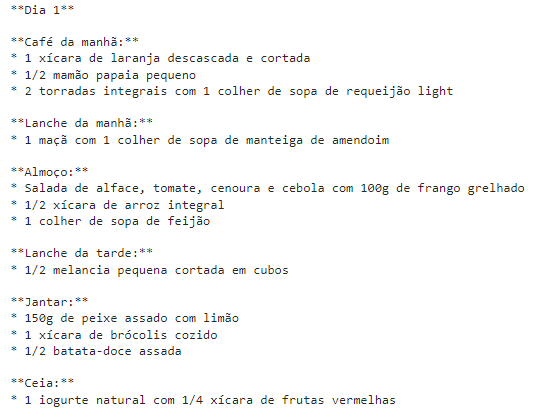

<h1 align="center">
  
   
  Cardápio Virtual
   
</h1>

  

  

  

<h2>Descrição</h2><align=justify>

 Este programa, em Python, desenvolvido através do Google Colab e com o uso da Inteligência Artificial do Google, conhecida como Gemini, gera cardápios personalizados com base nas informações fornecidas pelo usuário, como idade, peso, altura, gênero, preferências alimentares e nível de atividade física. 
  Com ele, você pode ter acesso a sugestões de refeições saudáveis e adequadas às suas necessidades.

<b> Conforme mencionado na apresentação do sistema:</b>
 <i>Embora este cardápio sirva como um guia inicial para uma alimentação mais saudável, é fundamental ressaltar que ele não substitui a consulta com um nutricionista.
  Um profissional capacitado poderá realizar uma avaliação mais completa e mais personalizada, considerando suas necessidades de vitaminas e sais minerais, estilo de vida, histórico de saúde e preferências alimentares.</i>

<h2>Funcionalidade</h2>
Coleta informações detalhadas do usuário sobre seus hábitos e preferências.
Gera um cardápio personalizado para o número de dias especificado.
Oferece opções de personalização, como exclusão de alimentos que o usuário não gosta ou por restrições alimentares.

<h2>Como Usar</h2>
Execute o programa: python Desafio_Alura.ipynb
Responda às perguntas sobre seus dados pessoais, preferências alimentares e nível de atividade física.
Aguarde a geração do seu cardápio personalizado!

<h2>Contato</h2>
Desenvolvido por <a target="_blank" href="https://github.com/AndreLuizLeaoArruda">André Luiz Leão Arruda</a> para o <a target="_blank" href="https://cursos.alura.com.br/imersao">Desafio da Imersão Alura + Google</a>.

<h2> Exemplo</h2>
Abaixo um exemplo das telas que aparecem no decorrer do processo.
 
 
 
 
 
 
